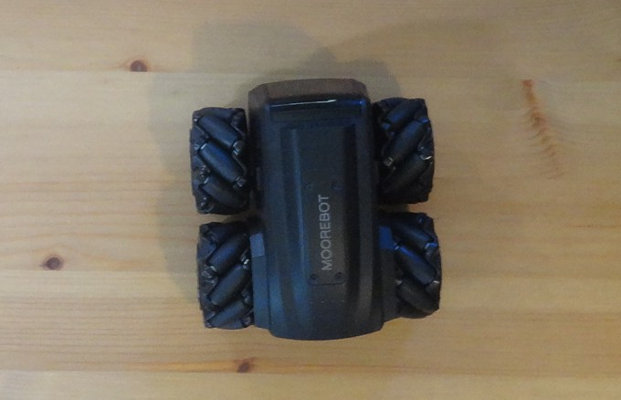

# moorebotPose - Moorebot Robot Pose Detection using YOLO11

A custom pose detection project using YOLO11 for detecting and tracking Moorebot scout robot keypoints for robotic applications and automation.



## Overview

This project implements robot pose detection using the YOLO11 pose estimation model specifically trained for Moorebot robots. It can detect robot poses in images and track keypoints for various applications such as robotic automation, quality control, industrial monitoring, and robot interaction systems.

## Features

- Custom training on Moorebot robot datasets
- Support for high-resolution images (up to 1920x1280)
- GPU acceleration with CUDA support
- Easy-to-use inference pipeline
- Visualization of detected robot poses with keypoints
- Comprehensive performance metrics and evaluation tools

## Installation

### Prerequisites
- Python 3.8+
- CUDA-capable GPU (recommended)
- Virtual environment (recommended)

### Setup

1. **Clone or download the project:**
   ```bash
   cd /path/to/your/project
   ```

2. **Create and activate virtual environment:**
   ```bash
   python3 -m venv venv
   source venv/bin/activate  # On Linux/Mac
   # or
   venv\Scripts\activate     # On Windows
   ```

3. **Install dependencies:**
   ```bash
   pip install ultralytics opencv-python torch torchvision
   ```

## Usage

### Training Custom Model

Train the model on your Moorebot dataset:

```bash
python training.py
```

### Model Evaluation

Evaluate your trained model on test data:

```bash
python test-evaluation.py      # Comprehensive test metrics
python test-individual.py      # Individual image testing
python pose-metrics-analysis.py # Detailed pose analysis
```

#### Pose metrics analysis

`pose-metrics-analysis.py` evaluates a trained Ultralytics YOLO pose model on the test split and reports:
- Pose metrics: mAP50, mAP75, and mAP50–95 (plus box mAPs)
- PCK@0.1 and PCK@0.2 (overall and per keypoint)
- A per-keypoint PCK bar chart saved under `runs/pose/pck/` (e.g., `pck_per_keypoint_YYYYMMDD-HHMMSS.png`)
- Object Keypoint Similarity (OKS) which measures similarity between predicted and ground-truth keypoints (0–1), normalized by object area and per-keypoint tolerances (sigmas). It is aggregated into AP the same way as detection mAP, but with OKS thresholds instead of IoU.

Reported metrics:
- OKS AP@[.50:.95]: mean AP over thresholds 0.50, 0.55, …, 0.95 (primary score).
- OKS AP@0.50: lenient match criterion.
- OKS AP@0.75: stricter localization.

Assumptions:
- Model weights path is set in the script
- Test data under `datasets/moorebot_vX/test/{images,labels}` (YOLO pose format)
- Keypoint names can be customized via `KEYPOINT_NAMES` (order maps to ids 0..K-1)

### Results Location

Outputs from testing are saved under a structured `tests/`:

- Pattern: `tests/<dataset>/<split>/<model>/<tag|timestamp>/`
- Example: `tests/moorebot_v4/test/yolo11n-moorebot_v5-pose-v1/smoke/DSC04824...jpg`

Control the final folder with `--tag` (falls back to a timestamp if omitted):

```bash
python test-individual.py --count 2 --tag smoke
```

### Grayscale Inference

You can run individual image tests in grayscale to evaluate robustness to lighting/texture:

```bash
python test-individual.py --grayscale
```

- By default, temporary grayscale copies are created under a split-specific temp folder (e.g., `dataset/<name>/<split>_gray_tmp`) and automatically deleted at the end of the run.
- To keep the grayscale temp images for inspection, add `--keep-temp`.

### Cleanup

If any grayscale temp folders remain (e.g., after an interrupted run), use the provided cleanup utility:

```bash
# Dry run: show what would be removed
python3 cleanup_gray_tmp.py --dry-run

# Actually remove found *_gray_tmp directories (non-interactive)
python3 cleanup_gray_tmp.py --yes

# Optional: limit scan to a specific root
python3 cleanup_gray_tmp.py --root dataset --yes
```

### Dataset Visualization

Visualize your training annotations:

```bash
python visualise-annotations.py        # Basic visualization
python visualise-annotations-arrows.py # Advanced visualization with arrows
```

**data.yaml configuration:**
```yaml
train: ../train/images
val: ../valid/images
test: ../test/images

kpt_shape: [3, 3]  # 3 keypoints, 3 dimensions (x,y,visibility)
flip_idx: [2, 1, 0]

nc: 1
names: ['robot']
```

## Datasets
The datasets can be found in roboflow universe:
- [version 5](https://universe.roboflow.com/moorebot-scout/moorebot-pose-g9lqr/dataset/5): New images added and the same pre-processing and augmentation applied as in version 4.
- [version 4](https://universe.roboflow.com/moorebot-scout/moorebot-pose-g9lqr/dataset/4): Data set curation performed to add preprocessing steps and augmentations.
- [version 3](https://universe.roboflow.com/moorebot-scout/moorebot-pose-g9lqr/dataset/3): More images added, keypoints sceleton remained the same.
- [version 2](https://universe.roboflow.com/moorebot-scout/moorebot-pose-g9lqr/dataset/2): Initial small datset, sceleton definition updated, results more promisin.
- [version 1](https://universe.roboflow.com/moorebot-scout/moorebot-pose-g9lqr/dataset/1): Initial small dataset, keypoints sceleton very strict defined, results were not so encouraging.

## Dependencies

- `ultralytics` - YOLO implementation
- `opencv-python` - Image processing and display
- `torch` - PyTorch deep learning framework
- `torchvision` - Computer vision utilities


